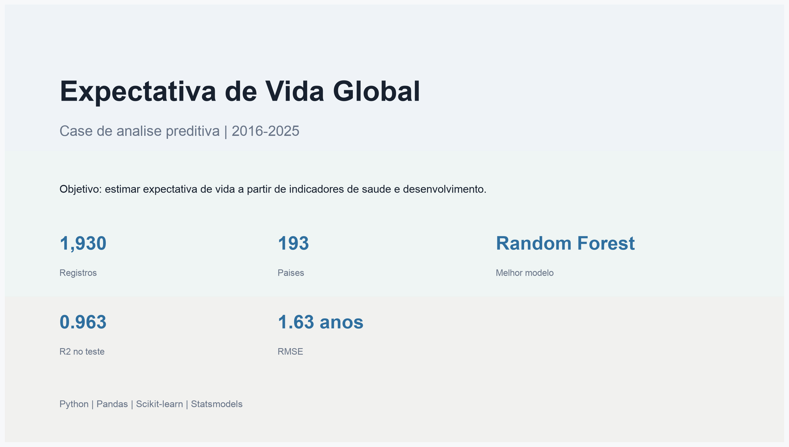
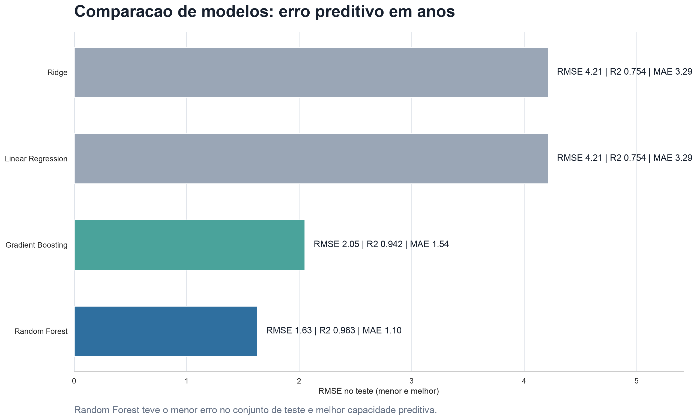
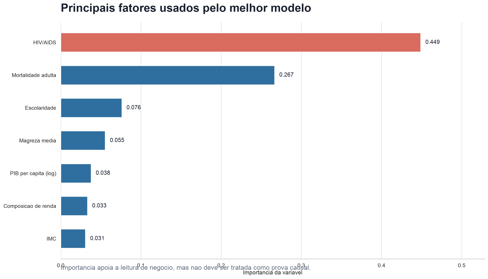
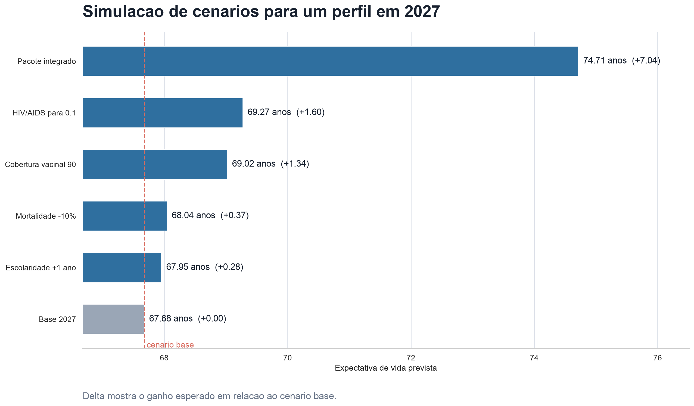
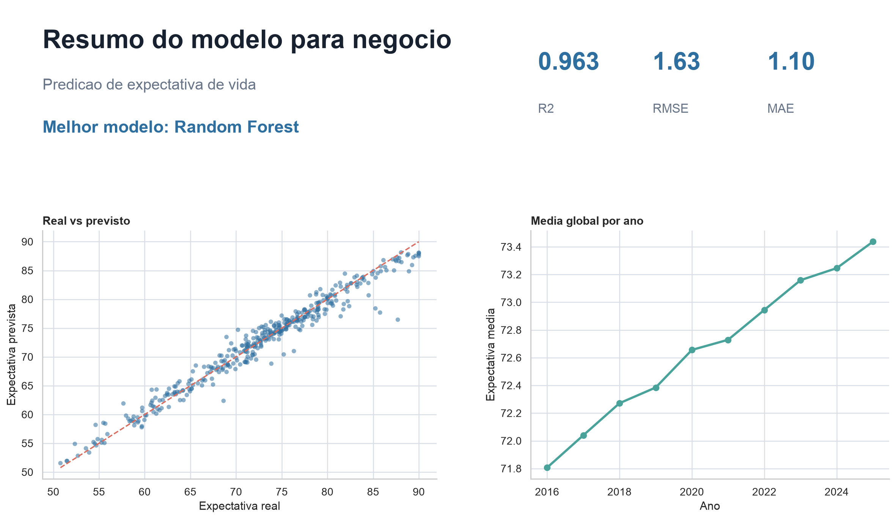

# Expectativa de Vida Global 2016-2025

Projeto de ciencia de dados aplicado a saude publica, com foco em prever a expectativa de vida de paises a partir de indicadores socioeconomicos e de saude.

O trabalho foi desenvolvido como um pipeline completo: analise exploratoria, limpeza dos dados, engenharia de atributos, modelagem estatistica, comparacao de modelos preditivos e simulacao de cenarios.



## Problema de negocio

A expectativa de vida ao nascer e um dos principais indicadores de desenvolvimento humano. Ela reflete, de forma agregada, condicoes de saude, renda, escolaridade, saneamento, cobertura vacinal e exposicao a doencas.

Neste projeto, o objetivo e responder:

> Quais fatores socioeconomicos e de saude mais influenciam a expectativa de vida, e como podemos usa-los para prever novos cenarios?

## Dados

O dataset cobre o periodo de 2016 a 2025 e contem informacoes por pais e ano.

Principais grupos de variaveis:

- Identificacao: pais, ano e status de desenvolvimento.
- Saude: mortalidade adulta, mortalidade infantil, HIV/AIDS, sarampo, IMC e cobertura vacinal.
- Socioeconomicas: PIB per capita, populacao, escolaridade, composicao de renda e gastos em saude.
- Variavel-alvo: expectativa de vida.

Arquivos principais:

```text
data/expectativa_vida_2016_2025.csv
data/df_clean.csv
life_expectancy_project.ipynb
requirements.txt
```

## Metodologia

O notebook segue as etapas abaixo:

1. Carregamento e inspecao inicial dos dados.
2. Analise de valores ausentes, duplicatas e inconsistencias.
3. Limpeza dos dados e padronizacao das colunas.
4. Engenharia de atributos, incluindo transformacoes logaritmicas e consolidacao de variaveis correlacionadas.
5. Analise exploratoria da variavel-alvo e comparacao entre paises desenvolvidos e em desenvolvimento.
6. Analise temporal por pais, incluindo maiores altas, maiores quedas e volatilidade.
7. Regressao OLS para interpretacao dos coeficientes.
8. Comparacao de modelos preditivos.
9. Validacao temporal, treinando em anos anteriores e testando em anos futuros.
10. Explicabilidade adicional por importancia de permutacao.
11. Avaliacao detalhada de erros por ano, faixa de expectativa de vida e pais.
12. Simulacao de cenarios de politica publica.

## Modelos testados

Foram comparados quatro modelos:

- Linear Regression
- Ridge
- Random Forest
- Gradient Boosting

Resultado da comparacao:

| Modelo | R2 no teste | RMSE | MAE |
|---|---:|---:|---:|
| Random Forest | 0.963 | 1.63 | 1.10 |
| Gradient Boosting | 0.942 | 2.05 | 1.54 |
| Linear Regression | 0.754 | 4.21 | 3.29 |
| Ridge | 0.754 | 4.21 | 3.29 |

O Random Forest apresentou o melhor desempenho geral, com menor erro medio e maior capacidade de explicacao no conjunto de teste.

Na validacao temporal, treinando com dados de 2016 a 2023 e testando em 2024-2025, o Random Forest manteve bom desempenho, com R2 de 0.921. Esse teste e mais proximo de um uso real, pois avalia previsao em anos posteriores aos usados no treino.



## Principais fatores

As variaveis mais relevantes para o modelo final foram associadas a carga de doencas, mortalidade, escolaridade, magreza media e renda.



Essas variaveis devem ser interpretadas como fatores preditivos relevantes, nao como prova causal. Para decisoes de politica publica, o resultado do modelo deve ser combinado com conhecimento tecnico, custo de implementacao e avaliacao de impacto.

## Simulacao de cenarios

O projeto tambem compara cenarios hipoteticos para um pais em desenvolvimento em 2027.



Na simulacao, o pacote integrado apresentou o maior ganho previsto em relacao ao cenario base. Esse pacote combina reducao de mortalidade adulta, aumento de cobertura vacinal, ganho de escolaridade e reducao de HIV/AIDS. A recomendacao deve ser vista como apoio a decisao, pois a aplicacao real depende de viabilidade operacional, custo e contexto sanitario.

## Resumo visual



## Como executar

Clone o repositorio:

```bash
git clone https://github.com/jaimejrs/life_expectancy_project.git
cd life_expectancy_project
```

Crie e ative um ambiente virtual:

```bash
python3 -m venv .venv
source .venv/bin/activate
```

Instale as dependencias:

```bash
pip install -r requirements.txt
```

Abra o arquivo `life_expectancy_project.ipynb` no VS Code, JupyterLab ou outro ambiente compativel com notebooks.

## Estrutura do repositorio

```text
.
├── data/
│   ├── df_clean.csv
│   └── expectativa_vida_2016_2025.csv
├── images/
│   ├── 01_case_cover.png
│   ├── 02_model_comparison.png
│   ├── 03_feature_importance.png
│   ├── 04_policy_scenarios.png
│   └── 05_model_summary.png
├── life_expectancy_project.ipynb
├── README.md
└── requirements.txt
```

## Observacoes

- O modelo tem finalidade preditiva e exploratoria.
- A importancia das variaveis nao implica causalidade.
- As simulacoes de cenarios devem ser interpretadas como apoio inicial a decisao.
- A avaliacao final de politicas publicas exige analise de custo, implementacao e impacto real.

## Tecnologias

- Python
- Pandas
- NumPy
- Matplotlib
- Seaborn
- Scikit-learn
- Statsmodels
